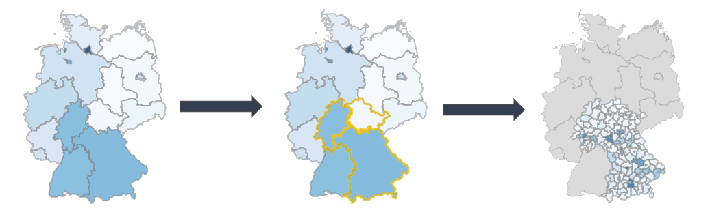

<!-- README.md is generated from README.Rmd. Please edit that file -->

# leafdown

<!-- badges: start -->

[](https://www.tidyverse.org/lifecycle/#experimental)
[](https://travis-ci.com/hoga-it/leafdown)
<!-- badges: end -->

The goal of leafdown is to provide drilldown functionality for leaflet
choropleths.



## Installation

You can install the released version of leafdown from
[CRAN](https://CRAN.R-project.org) with:

``` r
install.packages("leafdown")
```

And the development version from [GitHub](https://github.com/) with:

``` r
# install.packages("devtools")
devtools::install_github("hoga-it/leafdown")
```

## Features

  - Adds drilldown functionality for [leaflet
    choropleths](https://rstudio.github.io/leaflet/choropleths.html)
    maps.
  - Allows the selection of regions / shapes.
  - Easy to use and well integrated into syntax of the
    [leaflet](https://rstudio.github.io/leaflet/) R package.
  - Computationally efficient as drilldown only for regions of interest
