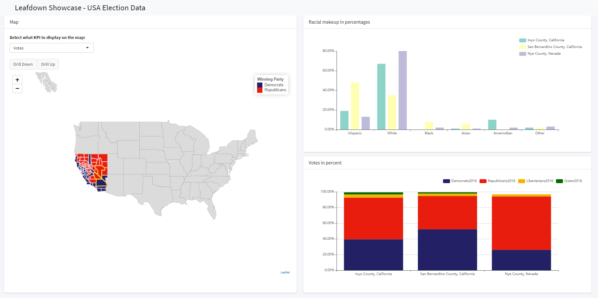

<!-- README.md is generated from README.Rmd. Please edit that file -->

# leafdown

<!-- badges: start -->

[](https://www.tidyverse.org/lifecycle/#experimental)
[](https://travis-ci.com/hoga-it/leafdown)
<!-- badges: end -->

The goal of leafdown is to provide drilldown functionality for leaflet
choropleths.


## Installation

<!--You can install the released version of leafdown from [CRAN](https://CRAN.R-project.org) with:

``` r
install.packages("leafdown")
```-->

You can install the development version from
[GitHub](https://github.com/) with:

``` r
# install.packages("devtools")
devtools::install_github("hoga-it/leafdown")
```

## Documentation

Please find the documentation
[here](https://hoga-it.github.io/leafdown/index.html)

## Features

  - Adds drilldown functionality for [leaflet
    choropleths](https://rstudio.github.io/leaflet/choropleths.html)
    maps.
  - Allows the selection of regions / shapes.
  - Easy to use and well integrated into syntax of the
    [leaflet](https://rstudio.github.io/leaflet/) R package.
  - Allows communication of the map with other shiny elements
    (e.g. Graphs).
  - Computationally efficient as drilldown only for regions of interest.

## Showcase - Election Map

To showcase the features of the `leafdown` package we have created a
demo app. <br> The app shows the 2016 us presidential election results
as well as some demographic information.<br> Click here for the [full
demo app](https://pega.shinyapps.io/election16/) <br> Click here for the
[documentation](https://hoga-it.github.io/leafdown/articles/Showcase_electionapp.html)

