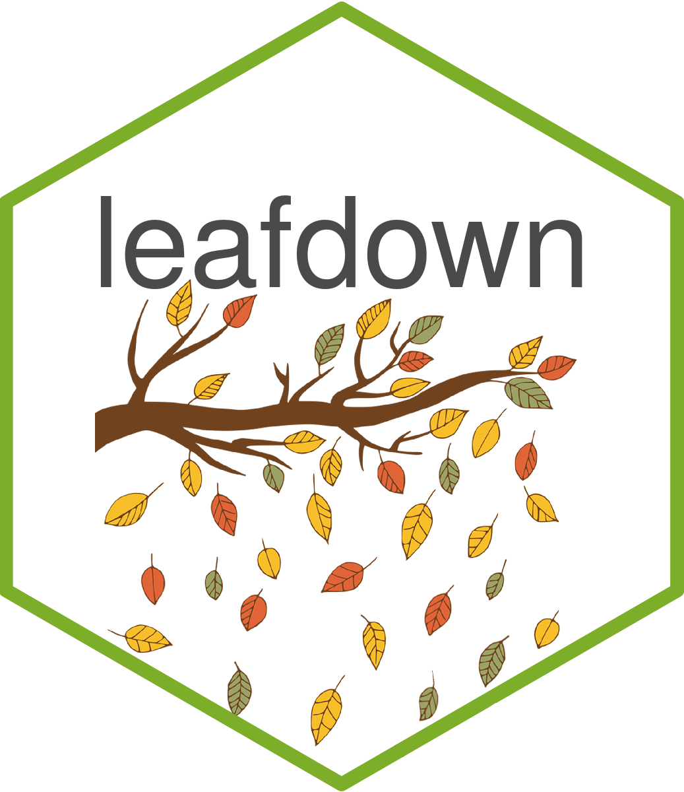
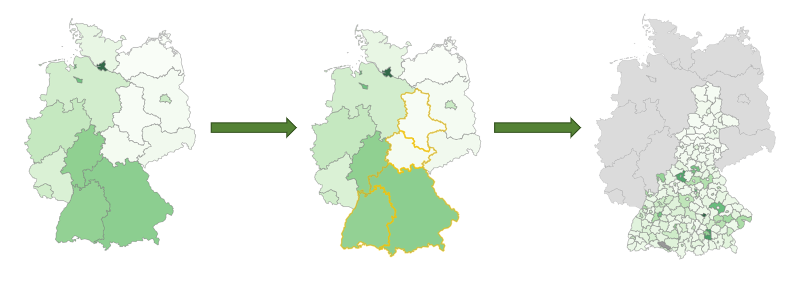

<!-- README.md is generated from README.Rmd. Please edit that file -->

# leafdown <a></a>

<!-- badges: start -->

[](https://lifecycle.r-lib.org/articles/stages.html#stable)
[](https://github.com/hoga-it/leafdown/actions)
<!-- badges: end -->

The leafdown package provides drilldown functionality for leaflet
choropleths in R Shiny apps.



## Installation

You can install the released version of leafdown from
[CRAN](https://CRAN.R-project.org) with:

``` r
install.packages("leafdown")
```

You can install the development version from
[GitHub](https://github.com/) with:

``` r
# install.packages("devtools")
devtools::install_github("hoga-it/leafdown")
```

## Documentation

You can find the documentation
[here](https://hoga-it.github.io/leafdown/index.html).

## Features

-   Adds drilldown functionality for [leaflet
    choropleths](https://rstudio.github.io/leaflet/choropleths.html)
    maps.
-   Allows the selection of regions/shapes.
-   Easy to use and well-integrated into syntax of the
    [leaflet](https://rstudio.github.io/leaflet/) R package.
-   Allows communication of the map with other shiny elements
    (e.g. graphs).
-   Computationally efficient as drilldown is only executed for selected
    regions of interest.
    
Andreas' [talk](https://www.rstudio.com/conference/2022/talks/leafdown-interactive-multi-layer-maps/) at the rstudio::conf(2022) 
provides a quick overview of the most important features of leafdown.

## Showcase - Election Map

To showcase the features of the `leafdown` package we have created a
demo app. <br>

This app shows the 2016 us presidential election results as well as some
demographic information.<br> Click here for the [full demo
app](https://pega.shinyapps.io/election16/) and here for the
[documentation](https://hoga-it.github.io/leafdown/articles/Showcase_electionapp.html).
<br> <br>


## Showcase - healthdown

The healthdown app allows interactive comparison of various health
factors at the U.S. state and county level. It was honored as “Runners
up” in the Shiny Contest 2021.

Link to healthdown: <https://hoga.shinyapps.io/healthdown/>.

Code: <https://github.com/hoga-it/healthdown>


