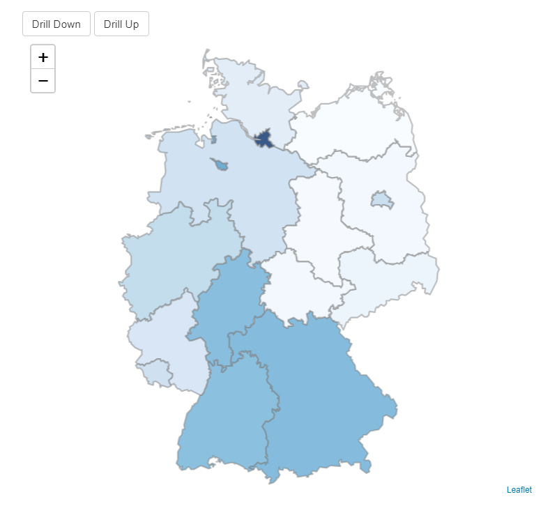

```{r, include = FALSE}
knitr::opts_chunk$set(
  collapse = TRUE,
  comment = "#>"
)
```

In this article we would like to give an example of how to create a very simple 
drilldown map with `leafdown`. \
The goal is to create a map that:

-  shows the GDP (gross domestic product) of the federal states of Germany 
-  allows the user to drill down to the administrative districts of selected federal states.

{width=250px, height=400px}

Let's first load the libraries we are going to use for our app. \

```{r setup, message=FALSE}
library(leafdown)
library(leaflet)
library(shiny)
library(dplyr)
library(shinyjs)
```

(Note that the `shinyjs` package is loaded for some automatic warning messages that the 
`leafdown` map can return to the user of the shiny app.)


## SpatialPolygonsDataFrames

`leafdown` requires a list of SpatialPolygonsDataFrames (spdfs) for the regions 
we want to display on our map.

To get these spdfs we can for example use the `getData` function of the `raster` package.
For "Germany", `level = 1` contains the spdf for the federal states
and `level = 2` the spdf for the administrative districts.

```{r, echo=FALSE}
ger1 <- readRDS("../inst/extdata/ger1-005.R")
ger2 <- readRDS("../inst/extdata/ger2-005.R")
```

```{r, eval=FALSE}
ger1 <- raster::getData(country = "Germany", level = 1)
ger2 <- raster::getData(country = "Germany", level = 2)
```

The spdf for `level = 2` does not display all German umlauts correctly. Therefore 
we adjust  some names so that we can assign our data more easily later on.
```{r, message=FALSE}
ger2@data[c(76, 99, 136, 226), "NAME_2"] <- c(
  "Fürth (Kreisfreie Stadt)",
  "München (Kreisfreie Stadt)",
  "Osnabrück (Kreisfreie Stadt)",
  "Würzburg (Kreisfreie Stadt)"
)
```

Let's now create our `spdfs_list` which we can provide to `leafdown` in our shiny app.
It is important that `spdfs_list` is ordered such that the spdf of the highest map level 
(in our case the federal states) is the first list element and so on.

```
list (spdfs_list)
│   
└───spdf (spdf of first map level)
│
└───spdf (spdf of second map level)

```

```{r}
spdfs_list <- list(ger1, ger2)
```


## Data

For this app we will use the example data sets that come with the `leafdown` package.
The data.frame `gdp_2014_federal_states`  contains the GPD of 2014 for the federal 
states and `gdp_2014_admin_districts` for the administrative districts of Germany.

```{r}
head(gdp_2014_federal_states)
```

```{r}
head(gdp_2014_admin_districts)
```

(For more information about the data, please see `?gdp_2014_federal_states` or
`?gdp_2014_admin_districts` respectively)


## Leafdown workflow
In this part we sketch the typical `leafdown` workflow. \
(Please note that the execution of the code snippets in this chapter
**only** work within a shiny app)

TODO: Replace this with picture

```{r, echo=FALSE, fig.width=7, eval= FALSE}
DiagrammeR::grViz(
  '
digraph { 
  rankdir=LR; 
  rank="same";
  graph [fontname = "Segoe UI", fontsize = 36, 
         nodesep="2", ranksep="1", color = dimgrey];
  node [fontname = "Segoe UI", fontsize = 30, color = dimgrey];
  edge [fontname = "Segoe UI", fontsize = 30, color = dimgrey];
  "Invisible"[style=invis];
  c0 [
    label = "Initialization \n ($new)", fillcolor  = palegreen, 
    style=filled, color = "grey"
  ];
  
  subgraph cluster01 { 
    label="Map Level 1"; 
    rank="same";
    a0 [label="Add Data \n ($add_data)", fillcolor = OldLace, style=filled]; 
    a1 [label="Draw Map \n ($draw_leafdown)",  fillcolor = Moccasin, style=filled]; 
    a2 [label="Select Shapes", fillcolor = lightyellow, style=filled]; 
    a3 [label="Drill Down \n ($drill_down)", fillcolor = PowderBlue, style=filled]; 
    a0 -> a1;
    a1 -> a2; 
    a2 -> a3; 
  }; 
  
  subgraph cluster02 
  {
    label="Map Level 2";
    rank="same";
    b0 [label="    Drill Up   \n ($drill_up)", fillcolor = PowderBlue, style=filled]; 
    b3 [label="   Add Data   \n ($add_data) ", fillcolor = OldLace, style=filled]; 
    b1 [label="..."]; 
    b2 [label="Draw Map \n ($draw_leafdown)", fillcolor = Moccasin, style=filled]; 
    
    b0 -> b1 [dir="back"]; 
    b1 -> b2 [dir="back"]; 
    b2 -> b3 [dir="back"]; 

  }; 
  
  edge[constraint=false]; 
  a1->b1 [style=invis]; 
  a2->b2 [style=invis]; 
  a3->b3 [style=dotted];
  b0->a0 [style=dotted];
  edge[constraint=true]; 
  Invisible -> b0[style=invis]; 
  edge[constraint=true]; 
  c0 -> a0;
  Invisible -> a0[style=invis]; 
  
  
} 
'
)
```


### Initialization

As usual for R6 classes, we create a new object of our `Leafdown` class using the
`new()` method. \
For this we have to specify the:

- `spdfs_list`: The list containing the spdfs of both map levels.
- `map_output_id`: The output_id we specify in our ui via `leafletOutput("<<map_output_id>>")`
- `input`: The `input` from the shiny app

```{r, echo=FALSE}
input <- reactiveValues(foo = "bar") # a little helper as we are currently not in a shiny session
```

```{r}
my_leafdown <- Leafdown$new(spdfs_list, map_output_id = "leafdown", input = input)
```


### Data

In the next step we add data to our `leafdown` object.
Using the method `$curr_metadata` we can retrieve the metadata of the 
current map level.
With metadata we refer to the data that describes the polygons, such as region names, 
region IDs, etc.

```{r}
metadata <- my_leafdown$curr_metadata
print(head(metadata))
```

Now we can add new columns for variables we want to display on our map to the existing metadata.
It is important that the initial metadata remains unchanged and no rows are removed.

```{r}
new_data <- metadata %>% dplyr::left_join(gdp_2014_federal_states, by = c("NAME_1" = "Federal_State"))
```

After creating our new data set, we give it to our `leafdown`object with the `$add_data` method.
```{r}
my_leafdown$add_data(new_data)
```

The current data of a `leafdown` object can be retrieved via the `$curr_data` attribute.
```{r}
print(head(my_leafdown$curr_data))
```

### Draw map

To draw the map we use the method `$draw_leafdown`.
The specified arguments in the method are internally handed over to the
`addPolygons` function of `leaflet`. Therefore attributes like `fillColor` or 
`opacity` can be specified just as for a usual `leaflet` map.

```{r, eval=FALSE}
map <- my_leafdown$draw_leafdown(
  fillColor = ~ colorNumeric("Blues", GDP_2014)(GDP_2014)
) 
```


The `$draw_leafdown` method returns a usual `leaflet` map. 
This also allows us to add a legend or a background to our map.

```{r, eval=FALSE}
map <- map %>%
  addLegend(
    pal = colorNumeric("Blues", data$GDP_2014),
    values = data$GDP_2014
  )
```

### Selection

Let's now have look at what happens when a user clicks on a region.
Internally a `leafdown` object has an observer for `shape_click` events.
Once a user clicks on a certain region, this region becomes "active" and
its boundaries on the map are highlighted.
(If the clicked region is already active, it becomes inactive).
We can retrieve the data of active regions via the `$curr_sel_data` attribute.
Assuming that the user clicked on Bavaria and Hesse than `$curr_sel_data` would 
look as follows:

```{r, eval=FALSE}
my_leafdown$curr_sel_data()
```

```{r, echo=FALSE}
subset(my_leafdown$curr_data, NAME_1 %in% c("Bayern", "Hessen"))
```

Note that this attribute is a `reactiveValue` which allows to update graphs and other 
elements upon a user click. (For more on the connection to other elements please
see the article: TODO: Refer to USA article)

### Drilldown

Using the `$drill_down` method we can now drill down to the admin districts of
the **active** federal states. 

```{r, eval=FALSE}
my_leafdown$drill_down()
```

This will update the currently active spdf (`my_leafdown$curr_spdf`) which then
only contains polygons and corresponding metadata for regions
whose parents were active in the upper (previous) map level.
In our case the parents are "Bavaria" and "Hesse", so only
spdfs of admin districts within these federal states will be contained in 
`my_leafdown$curr_spdf`.

```{r, eval=FALSE}
length(my_leafdown$curr_spdf)
```
```{r, echo=FALSE}
print(2)
```


### Data

The updated metadata can then again be retrieved via `$curr_metadata`.

```{r eval = FALSE}
my_leafdown$drill_down()
metadata <- my_leafdown$curr_metadata
head(metadata)
```

```{r echo=FALSE}
head(subset(ger2@data, GID_1 %in% c("DEU.2_1", "DEU.7_1")))
```

```{r eval = FALSE}
unique(metadata$NAME_1)
```

```{r echo=FALSE}
c("Bayern", "Hessen")
```

Just as before we can add new columns for variables we want to display on our map 
to the existing metadata.

```{r, eval=FALSE}
new_data <- metadata %>% 
  dplyr::left_join(gdp_2014_admin_districts, by = c("NAME_2" = "Admin_District"))
my_leafdown$add_data(new_data)
```

Again, the current data can be retrieved via the `$curr_data` attribute.

```{r, eval=FALSE}
head(my_leafdown$curr_data)
```

```{r, echo=FALSE}
ger2@data %>% 
  filter(GID_1 %in% c("DEU.2_1", "DEU.7_1")) %>% 
  dplyr::left_join(gdp_2014_admin_districts, by = c("NAME_2" = "Admin_District")) %>% 
  slice_head(n = 5) %>% 
  as.data.frame()
```


### Draw map

```{r, eval=FALSE}
my_leafdown$draw_leafdown(
  fillColor = ~ colorNumeric("Blues", GDP_2014)(GDP_2014)
)
```


All non active parent regions grayed out in the background.


### Drillup

TO DO: Explain drill-down and drill up functionality
Drilldown

- updates the spdf and the metadata
- at the new map level the new spdf only contains polygons and data of regions 
which parents were selected in the upper map level. 
- Note that the initial spdf_list remains unchanged.

```{r}
new_data <- metadata %>% left_join(gdp_2014_federal_states, by = c("NAME_1" = "Federal_State"))
```


### Draw map

Results in the same map as at the beginning
Active regions are still active.


## Shiny App

Let's now define a very basic UI with only two buttons for drilldown and 
drillup and the `leaflet` UI element in which we can render our `leafdown` map.

### UI
```{r, eval=FALSE}
ui <- shiny::fluidPage(
  tags$style(HTML(".leaflet-container {background: #ffffff;}")),
  useShinyjs(),
  actionButton("drill_down", "Drill Down"),
  actionButton("drill_up", "Drill Up"),
  leafletOutput("leafdown", height = 600),
)
```

### Server

```{r}
# Little helper function for hover labels
create_labels <- function(data, map_level) {
  labels <- sprintf(
    "<strong>%s</strong><br/>%g € per capita</sup>",
    data[, paste0("NAME_", map_level)], data$GDP_2014
  )
  labels %>% lapply(htmltools::HTML)
}
```


```{r, eval=FALSE}
server <- function(input, output) {
  my_leafdown <- Leafdown$new(spdfs_list, "leafdown", input)
  update_leafdown <- reactiveVal(0)

  observeEvent(input$drill_down, {
    my_leafdown$drill_down()
    update_leafdown(update_leafdown() + 1)
  })

  observeEvent(input$drill_up, {
    my_leafdown$drill_up()
    update_leafdown(update_leafdown() + 1)
  })

  output$leafdown <- renderLeaflet({
    update_leafdown()
    meta_data <- my_leafdown$curr_metadata
    curr_map_level <- my_leafdown$curr_map_level
    if (curr_map_level == 1) {
      data <- meta_data %>% left_join(gdp_2014_federal_states, by = c("NAME_1" = "Federal_State"))
    } else {
      data <- meta_data %>% left_join(gdp_2014_admin_districts, by = c("NAME_2" = "Admin_District"))
    }

    my_leafdown$add_data(data)
    labels <- create_labels(data, curr_map_level)
    my_leafdown$draw_leafdown(
      fillColor = ~ colorNumeric("Blues", GDP_2014)(GDP_2014),
      weight = 2, fillOpacity = 0.8, color = "grey", label = labels,
      highlight = highlightOptions(weight = 5, color = "#666", fillOpacity = 0.7)
    ) %>%
      addLegend("topright",
        pal = colorNumeric("Blues", data$GDP_2014),
        values = data$GDP_2014,
        title = "GDP per capita (2014)",
        labFormat = labelFormat(suffix = "€"),
        opacity = 1
      )
  })
}
```

### Run App
```{r, eval=FALSE}
shinyApp(ui, server)
```

<style>
.shiny-app-frame {
  position: relative;
  height: 700px;
}
.shiny-app-frame iframe {
  width: 100%;
  height: 100%;
  border: none;
}
</style>

<br>
<div class="shiny-app-frame"> 
<iframe src="https://andreasho95.shinyapps.io/leafdown-basic-example/">
</iframe>
</div>


