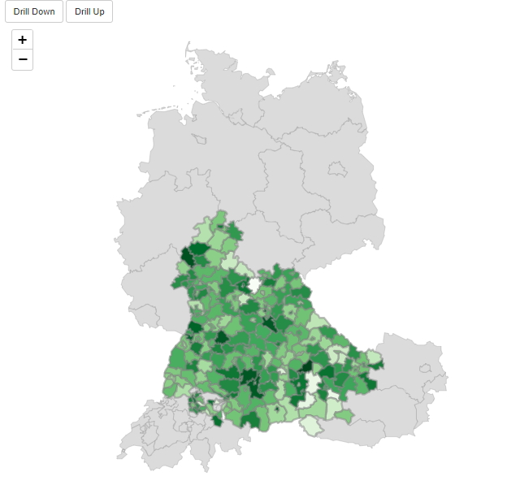

```{r, include = FALSE}
knitr::opts_chunk$set(
  collapse = TRUE,
  comment = "#>"
)
```


In this article, we demonstrate how to set up a `leafdown` map with three map levels and show that it is an natural
extension of the two map level case. (More than two map levels is supported from `leafdown` version 1.1.)

```{r, echo=FALSE, out.width="70%"}

```

Let's first load the libraries we are going to use for our app. \

```{r setup, message=FALSE,warning=FALSE}
library(leafdown)
library(leaflet)
library(shiny)
library(dplyr)
library(shinycssloaders)
library(shinyjs)
library(dplyr)
library(raster)
```

(Note that the `shinyjs` package is loaded for some automatic warning messages that the 
`leafdown` map can return to the user of the shiny app.)


## SpatialPolygonsDataFrames

As usual, we first create a list of `SpatialPolygonsDataFrames` (`spdfs`) for the regions we want to display on our map.
(Further details can be found in the [Introduction article](https://hoga-it.github.io/leafdown/articles/Introduction.html).)

```
list (spdfs_list)
│   
└───spdf (spdf of first map level)
│
└───spdf (spdf of second map level)
│
└───spdf (spdf of third map level)
```

```{r, echo=FALSE}
ger0 <- readRDS("../inst/extdata/ger0-005.RDS")
ger1 <- readRDS("../inst/extdata/ger1-005.RDS")
ger2 <- readRDS("../inst/extdata/ger2-005.RDS")
aut0 <- readRDS("../inst/extdata/a0-005.RDS")
aut1 <- readRDS("../inst/extdata/a1-005.RDS")
aut2 <- readRDS("../inst/extdata/a2-005.RDS")
ch0 <- readRDS("../inst/extdata/ch0-005.RDS")
ch1 <- readRDS("../inst/extdata/ch1-005.RDS")
ch2 <- readRDS("../inst/extdata/ch2-005.RDS")
```

```{r, eval=FALSE}
# Germany
ger0 <- raster::getData(country = "Germany", level = 0)
ger1 <- raster::getData(country = "Germany", level = 1)
ger2 <- raster::getData(country = "Germany", level = 2)
# Austria
a0 <- raster::getData(country = "Austria", level = 0)
a1 <- raster::getData(country = "Austria", level = 1)
a2 <- raster::getData(country = "Austria", level = 2)
# Switzerland
ch0 <- raster::getData(country = "Switzerland", level = 0)
ch1 <- raster::getData(country = "Switzerland", level = 1)
ch2 <- raster::getData(country = "Switzerland", level = 2)
```

```{r, message=FALSE}
spdfs_list <- list(rbind(aut0, ch0, ger0), rbind(aut1, ch1, ger1), rbind(aut2, ch2, ger2))
```


## Data

For this app, we simply generate random target values `y`.

```{r, message=FALSE}
set.seed(20220106)
# Simulate data
data_sim_y_level_3 <- spdfs_list[[3]]@data
data_sim_y_level_3$y <- round(rnorm(nrow(data_sim_y_level_3), 1e2, sd = 5e2), 0)
data_sim_y_level_2 <- data_sim_y_level_3 %>% group_by(NAME_0, NAME_1) %>% summarise(y = sum(y))
data_sim_y_level_1 <- data_sim_y_level_2 %>% group_by(NAME_0) %>% summarise(y = sum(y))

# Assign map levels
data_sim_y_level_3$level <- 3
data_sim_y_level_2$level <- 2
data_sim_y_level_1$level <- 1

# Assign area names
data_sim_y_level_3$area <- data_sim_y_level_3$NAME_2
data_sim_y_level_2$area <- data_sim_y_level_2$NAME_1
data_sim_y_level_1$area <- data_sim_y_level_1$NAME_0

# Combine data of map levels
data_sim_y <- rbind(
  data_sim_y_level_3[, c("area", "y", "level")],
  data_sim_y_level_2[, c("area", "y", "level")],
  data_sim_y_level_1[, c("area", "y", "level")]
)

head(data_sim_y)
```

## Joining map levels

In order for a `leafdown` map to know which shapes of a lower map level belong to the shapes in the upper map level, we
need to specify how the data of the `spdfs` of different map levels need to be joined. \newline
This is defined by the `join_map_levels_by` argument, which is a named vector of length `length(spdfs_list) - 1`, whereby

- the first (named) element specifies how to join the first and the second map level
- the second (named) element specifies how to join the second and the third map level
- and so on.

The name of an element specifies the join column in the respective upper map level and the actual element the join column 
of the lower map level.

Let's have a look at the data of our the `spdfs` in `spdf_list`:

```{r}
head(spdfs_list[[1]]@data)
```

```{r}
head(spdfs_list[[2]]@data[, c("GID_0", "NAME_0", "GID_1", "NAME_1")])
```

In this example, map levels 1 and 2 can be joined by their column "GID_0". So the name of first element is "GID_0" 
(the respective column name of the first map level) and the first element is also "GID_0" (the respective column name of 
the first map level):

```{r}
head(spdfs_list[[3]]@data[, c("GID_0", "NAME_0", "GID_1", "NAME_1", "GID_2", "NAME_2")])
```

We see, that map levels 2 and 3 can be joined by their column "GID_1".

This translates into the following `join_map_levels_by` argument:

```{r, eval=FALSE}
my_leafdown <- Leafdown$new(
  spdfs_list, "leafdown", input, join_map_levels_by = c("GID_0" = "GID_0", "GID_1" = "GID_1")
)
```


## Shiny App

### Preparation

```{r, eval=FALSE}
library(leafdown)
library(leaflet)
library(shiny)
library(dplyr)
library(shinycssloaders)
library(shinyjs)
library(dplyr)
library(raster)

# Germany
ger0 <- raster::getData(country = "Germany", level = 0)
ger1 <- raster::getData(country = "Germany", level = 1)
ger2 <- raster::getData(country = "Germany", level = 2)
# Austria
a0 <- raster::getData(country = "Austria", level = 0)
a1 <- raster::getData(country = "Austria", level = 1)
a2 <- raster::getData(country = "Austria", level = 2)
# Switzerland
ch0 <- raster::getData(country = "Switzerland", level = 0)
ch1 <- raster::getData(country = "Switzerland", level = 1)
ch2 <- raster::getData(country = "Switzerland", level = 2)

# load the shapes for the three levels
spdfs_list <- list(rbind(aut0, ch0, ger0), rbind(aut1, ch1, ger1), rbind(aut2, ch2, ger2))

# Simulate some data
set.seed(20220106)
data_sim_y_level_3 <- spdfs_list[[3]]@data
data_sim_y_level_3$y <- rnorm(nrow(data_sim_y_level_3), 1e2, sd = 5e2)
data_sim_y_level_2 <- data_sim_y_level_3 %>% group_by(NAME_0, NAME_1) %>% summarise(y = sum(y))
data_sim_y_level_1 <- data_sim_y_level_2 %>% group_by(NAME_0) %>% summarise(y = sum(y))

data_sim_y_level_3$level <- 3
data_sim_y_level_2$level <- 2
data_sim_y_level_1$level <- 1

data_sim_y_level_3$area <- data_sim_y_level_3$NAME_2
data_sim_y_level_2$area <- data_sim_y_level_2$NAME_1
data_sim_y_level_1$area <- data_sim_y_level_1$NAME_0

data_sim_y <- rbind(
  data_sim_y_level_3[, c("area", "y", "level")],
  data_sim_y_level_2[, c("area", "y", "level")],
  data_sim_y_level_1[, c("area", "y", "level")]
)
data_sim_y$y <- round(data_sim_y$y, 0)
```

### UI
```{r, eval=FALSE}
ui <- fluidPage(
  mainPanel(
    # set the background of the map-container to be white
    tags$head(
      tags$style(HTML(".leaflet-container { background: #fff; height: 100%}")),
      # workaround for the NA in leaflet legend see https://github.com/rstudio/leaflet/issues/615
      tags$style(HTML(".leaflet-control div:last-child {clear: both;}"))
    ),
    # we need shinyjs for the leafdown map
    useShinyjs(),
    fluidRow(
      # the two buttons used for drilling
      actionButton("drill_down", "Drill Down"),
      actionButton("drill_up", "Drill Up"),
      # the actual map element
      withSpinner(leafletOutput("leafdown", height = 800), type = 8)
    )
  )
)

```

### Server

```{r}
# Little helper function for hover labels
create_labels <- function(data, map_level) {
  labels <- sprintf(
    "<strong>%s</strong><br/>%g</sup>",
    data[, paste0("NAME_", map_level - 1)], data$y
  )
  labels %>% lapply(htmltools::HTML)
}
```


```{r, eval=FALSE}
server <- function(input, output) {

  # create leafdown object
  my_leafdown <- Leafdown$new(
    spdfs_list, "leafdown", input, join_map_levels_by = c("GID_0" = "GID_0", "GID_1" = "GID_1")
  )

  rv <- reactiveValues()
  rv$update_leafdown <- 0

  # observers for the drilling buttons
  observeEvent(input$drill_down, {
    my_leafdown$drill_down()
    rv$update_leafdown <- rv$update_leafdown + 1
  })

  observeEvent(input$drill_up, {
    my_leafdown$drill_up()
    rv$update_leafdown <- rv$update_leafdown + 1
  })

  data <- reactive({
    req(rv$update_leafdown)
    meta_data <- my_leafdown$curr_data
    curr_map_level <- my_leafdown$curr_map_level
    data_curr_map_level <- data_sim_y[data_sim_y$level == curr_map_level, ]
    join_col_lhs <- paste0("NAME_", curr_map_level - 1)
    data <- meta_data %>% left_join(data_curr_map_level, by = setNames("area", join_col_lhs))

    # add the data back to the leafdown object
    my_leafdown$add_data(data)
    data
  })

  # this is where the leafdown magic happens
  output$leafdown <- renderLeaflet({
    req(spdfs_list)
    req(data)

    data <- data()
    labels <- create_labels(data, my_leafdown$curr_map_level)
    # draw the leafdown object
    my_leafdown$draw_leafdown(
      fillColor = ~leaflet::colorNumeric("Greens", data$y)(data$y),
      weight = 3, fillOpacity = 1, color = "grey", label = labels
    )
  })
}
```

### Run App
```{r, eval=FALSE}
shinyApp(ui, server)
```

<style>
.shiny-app-frame {
  position: relative;
  height: 1100px;
}
.shiny-app-frame iframe {
  width: 100%;
  height: 100%;
  border: none;
}
</style>

<br>
<div class="shiny-app-frame"> 
<iframe src="https://andreasho95.shinyapps.io/leafdown-multi-level/">
</iframe>
</div>
